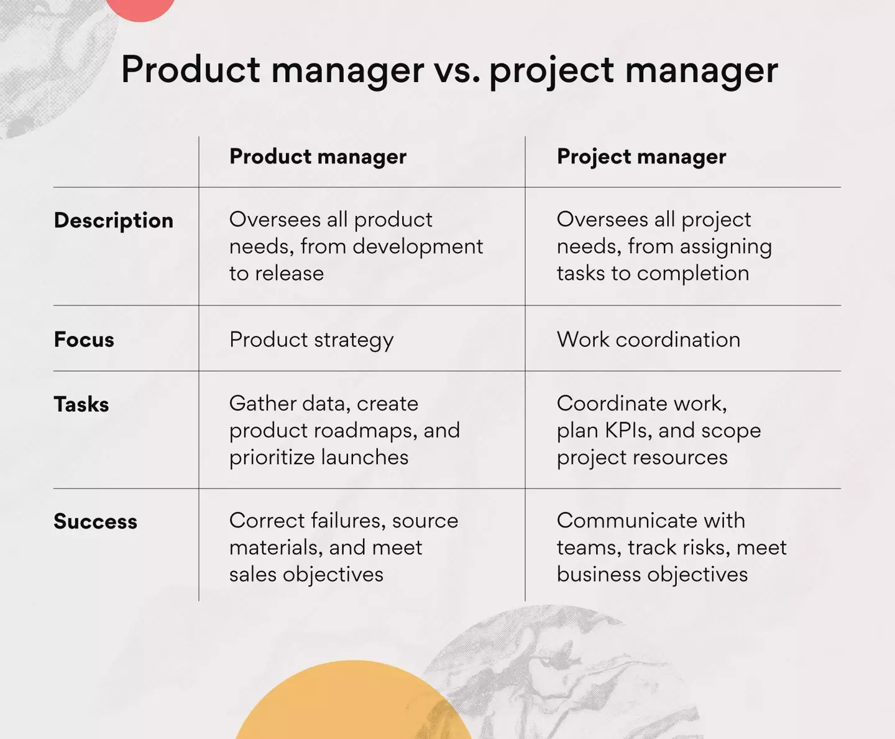

# Navigating the Landscape: Your Journey through Project Management Roles in Software Development

Embarking on a journey into the world of software development? You'll encounter different roles responsible for steering projects and products towards success. Imagine this journey as an expedition through diverse landscapes, each with its unique features and challenges. Today, we're your guides, taking you through this exciting journey of Project Managers (PMs) and Product Managers (PMs).

## 1. Project Manager (PM) – The Navigator

As you begin your journey, you'll meet the Project Manager, often referred to as "The Navigator." Their role is akin to steering the ship, ensuring it stays on course and reaches its destination safely.

### What Do They Do?
The Navigator provides leadership and technical expertise, charting the path forward. They keep a watchful eye on the horizon, making sure the team completes tasks correctly and on time. Like a skilled interpreter, they bridge the gap between the crew (developers) and the passengers (stakeholders).

### Why Are They Important?
Their significance lies in ensuring that passengers (clients) have a smooth voyage, receiving high-quality software, and reaching their desired destination.

### How Do They Achieve This?
The Navigator employs various tools and techniques. They communicate with passengers (clients), assign roles and responsibilities to the crew, and create a roadmap, complete with schedules and budgets. Like a vigilant lookout, they manage changes and request additional resources when necessary, ensuring a safe journey. Finally, they check the ship's quality (software) to ensure it's seaworthy (high-quality).

## 2. Product Manager (PM) – The Cartographer

Continuing your journey, you'll come across the Product Manager, known as "The Cartographer." They are like skilled mapmakers, charting the terrain and guiding the expedition.

### What Do They Do?
The Cartographer's task is to understand the lay of the land. They identify customer needs, draw the map of success criteria, and lead a team of explorers (cross-functional teams) to follow the map.

### Why Are They Important?
Their importance lies in ensuring that the expedition (product development) aligns with the landscape (customer needs and business goals), reducing the risk of getting lost along the way.

### How Do They Achieve This?
The Cartographer uses tools like user research to uncover hidden treasures (customer insights), watches for changes in the landscape (market monitoring), and sketches a clear path (product vision). They prioritize landmarks (product features) based on the team's journey (customer feedback and business objectives).

## 3. Understanding the Difference – The Junction

As your journey progresses, you'll reach a junction, where the paths of The Navigator and The Cartographer diverge.

_Source: Pexels_

The Cartographer focuses on mapping the terrain (product development) to ensure it aligns with the landscape (customer needs and business goals). Meanwhile, The Navigator concentrates on steering the ship (project execution) to reach the destination on time and within budget.

_Source:_ [_Asana_](https://asana.com/resources/product-manager-vs-project-manager)
